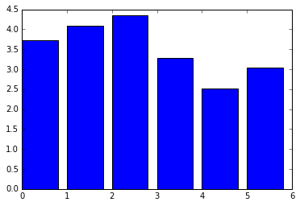
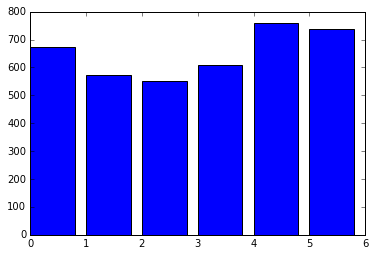
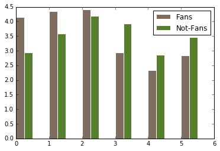

# Reproducing Star Wars Analysis in Python

For this project, I will reproduce analysis done by [538](https://fivethirtyeight.com/features/americas-favorite-star-wars-movies-and-least-favorite-characters/) asking if American realizes that "The Empire Stikes Back" is the best of the Star Wars films. Their survey includes [835 responses] (https://github.com/fivethirtyeight/data/tree/master/star-wars-survey). 

For this project, I will be cleaning and exploring the data. 


```python
import pandas as pd
star_wars = pd.read_csv("star_wars.csv", encoding="ISO-8859-1")
```


```python
star_wars.head(10)
```


<div>
<style scoped>
    .dataframe tbody tr th:only-of-type {
        vertical-align: middle;
    }

    .dataframe tbody tr th {
        vertical-align: top;
    }

    .dataframe thead th {
        text-align: right;
    }
</style>
<table border="1" class="dataframe">
  <thead>
    <tr style="text-align: right;">
      <th></th>
      <th>RespondentID</th>
      <th>Have you seen any of the 6 films in the Star Wars franchise?</th>
      <th>Do you consider yourself to be a fan of the Star Wars film franchise?</th>
      <th>Which of the following Star Wars films have you seen? Please select all that apply.</th>
      <th>Unnamed: 4</th>
      <th>Unnamed: 5</th>
      <th>Unnamed: 6</th>
      <th>Unnamed: 7</th>
      <th>Unnamed: 8</th>
      <th>Please rank the Star Wars films in order of preference with 1 being your favorite film in the franchise and 6 being your least favorite film.</th>
      <th>...</th>
      <th>Unnamed: 28</th>
      <th>Which character shot first?</th>
      <th>Are you familiar with the Expanded Universe?</th>
      <th>Do you consider yourself to be a fan of the Expanded Universe?ξ</th>
      <th>Do you consider yourself to be a fan of the Star Trek franchise?</th>
      <th>Gender</th>
      <th>Age</th>
      <th>Household Income</th>
      <th>Education</th>
      <th>Location (Census Region)</th>
    </tr>
  </thead>
  <tbody>
    <tr>
      <th>0</th>
      <td>NaN</td>
      <td>Response</td>
      <td>Response</td>
      <td>Star Wars: Episode I  The Phantom Menace</td>
      <td>Star Wars: Episode II  Attack of the Clones</td>
      <td>Star Wars: Episode III  Revenge of the Sith</td>
      <td>Star Wars: Episode IV  A New Hope</td>
      <td>Star Wars: Episode V The Empire Strikes Back</td>
      <td>Star Wars: Episode VI Return of the Jedi</td>
      <td>Star Wars: Episode I  The Phantom Menace</td>
      <td>...</td>
      <td>Yoda</td>
      <td>Response</td>
      <td>Response</td>
      <td>Response</td>
      <td>Response</td>
      <td>Response</td>
      <td>Response</td>
      <td>Response</td>
      <td>Response</td>
      <td>Response</td>
    </tr>
    <tr>
      <th>1</th>
      <td>3.292880e+09</td>
      <td>Yes</td>
      <td>Yes</td>
      <td>Star Wars: Episode I  The Phantom Menace</td>
      <td>Star Wars: Episode II  Attack of the Clones</td>
      <td>Star Wars: Episode III  Revenge of the Sith</td>
      <td>Star Wars: Episode IV  A New Hope</td>
      <td>Star Wars: Episode V The Empire Strikes Back</td>
      <td>Star Wars: Episode VI Return of the Jedi</td>
      <td>3</td>
      <td>...</td>
      <td>Very favorably</td>
      <td>I don't understand this question</td>
      <td>Yes</td>
      <td>No</td>
      <td>No</td>
      <td>Male</td>
      <td>18-29</td>
      <td>NaN</td>
      <td>High school degree</td>
      <td>South Atlantic</td>
    </tr>
    <tr>
      <th>2</th>
      <td>3.292880e+09</td>
      <td>No</td>
      <td>NaN</td>
      <td>NaN</td>
      <td>NaN</td>
      <td>NaN</td>
      <td>NaN</td>
      <td>NaN</td>
      <td>NaN</td>
      <td>NaN</td>
      <td>...</td>
      <td>NaN</td>
      <td>NaN</td>
      <td>NaN</td>
      <td>NaN</td>
      <td>Yes</td>
      <td>Male</td>
      <td>18-29</td>
      <td>$0 - $24,999</td>
      <td>Bachelor degree</td>
      <td>West South Central</td>
    </tr>
    <tr>
      <th>3</th>
      <td>3.292765e+09</td>
      <td>Yes</td>
      <td>No</td>
      <td>Star Wars: Episode I  The Phantom Menace</td>
      <td>Star Wars: Episode II  Attack of the Clones</td>
      <td>Star Wars: Episode III  Revenge of the Sith</td>
      <td>NaN</td>
      <td>NaN</td>
      <td>NaN</td>
      <td>1</td>
      <td>...</td>
      <td>Unfamiliar (N/A)</td>
      <td>I don't understand this question</td>
      <td>No</td>
      <td>NaN</td>
      <td>No</td>
      <td>Male</td>
      <td>18-29</td>
      <td>$0 - $24,999</td>
      <td>High school degree</td>
      <td>West North Central</td>
    </tr>
    <tr>
      <th>4</th>
      <td>3.292763e+09</td>
      <td>Yes</td>
      <td>Yes</td>
      <td>Star Wars: Episode I  The Phantom Menace</td>
      <td>Star Wars: Episode II  Attack of the Clones</td>
      <td>Star Wars: Episode III  Revenge of the Sith</td>
      <td>Star Wars: Episode IV  A New Hope</td>
      <td>Star Wars: Episode V The Empire Strikes Back</td>
      <td>Star Wars: Episode VI Return of the Jedi</td>
      <td>5</td>
      <td>...</td>
      <td>Very favorably</td>
      <td>I don't understand this question</td>
      <td>No</td>
      <td>NaN</td>
      <td>Yes</td>
      <td>Male</td>
      <td>18-29</td>
      <td>$100,000 - $149,999</td>
      <td>Some college or Associate degree</td>
      <td>West North Central</td>
    </tr>
    <tr>
      <th>5</th>
      <td>3.292731e+09</td>
      <td>Yes</td>
      <td>Yes</td>
      <td>Star Wars: Episode I  The Phantom Menace</td>
      <td>Star Wars: Episode II  Attack of the Clones</td>
      <td>Star Wars: Episode III  Revenge of the Sith</td>
      <td>Star Wars: Episode IV  A New Hope</td>
      <td>Star Wars: Episode V The Empire Strikes Back</td>
      <td>Star Wars: Episode VI Return of the Jedi</td>
      <td>5</td>
      <td>...</td>
      <td>Somewhat favorably</td>
      <td>Greedo</td>
      <td>Yes</td>
      <td>No</td>
      <td>No</td>
      <td>Male</td>
      <td>18-29</td>
      <td>$100,000 - $149,999</td>
      <td>Some college or Associate degree</td>
      <td>West North Central</td>
    </tr>
    <tr>
      <th>6</th>
      <td>3.292719e+09</td>
      <td>Yes</td>
      <td>Yes</td>
      <td>Star Wars: Episode I  The Phantom Menace</td>
      <td>Star Wars: Episode II  Attack of the Clones</td>
      <td>Star Wars: Episode III  Revenge of the Sith</td>
      <td>Star Wars: Episode IV  A New Hope</td>
      <td>Star Wars: Episode V The Empire Strikes Back</td>
      <td>Star Wars: Episode VI Return of the Jedi</td>
      <td>1</td>
      <td>...</td>
      <td>Very favorably</td>
      <td>Han</td>
      <td>Yes</td>
      <td>No</td>
      <td>Yes</td>
      <td>Male</td>
      <td>18-29</td>
      <td>$25,000 - $49,999</td>
      <td>Bachelor degree</td>
      <td>Middle Atlantic</td>
    </tr>
    <tr>
      <th>7</th>
      <td>3.292685e+09</td>
      <td>Yes</td>
      <td>Yes</td>
      <td>Star Wars: Episode I  The Phantom Menace</td>
      <td>Star Wars: Episode II  Attack of the Clones</td>
      <td>Star Wars: Episode III  Revenge of the Sith</td>
      <td>Star Wars: Episode IV  A New Hope</td>
      <td>Star Wars: Episode V The Empire Strikes Back</td>
      <td>Star Wars: Episode VI Return of the Jedi</td>
      <td>6</td>
      <td>...</td>
      <td>Very favorably</td>
      <td>Han</td>
      <td>Yes</td>
      <td>No</td>
      <td>No</td>
      <td>Male</td>
      <td>18-29</td>
      <td>NaN</td>
      <td>High school degree</td>
      <td>East North Central</td>
    </tr>
    <tr>
      <th>8</th>
      <td>3.292664e+09</td>
      <td>Yes</td>
      <td>Yes</td>
      <td>Star Wars: Episode I  The Phantom Menace</td>
      <td>Star Wars: Episode II  Attack of the Clones</td>
      <td>Star Wars: Episode III  Revenge of the Sith</td>
      <td>Star Wars: Episode IV  A New Hope</td>
      <td>Star Wars: Episode V The Empire Strikes Back</td>
      <td>Star Wars: Episode VI Return of the Jedi</td>
      <td>4</td>
      <td>...</td>
      <td>Very favorably</td>
      <td>Han</td>
      <td>No</td>
      <td>NaN</td>
      <td>Yes</td>
      <td>Male</td>
      <td>18-29</td>
      <td>NaN</td>
      <td>High school degree</td>
      <td>South Atlantic</td>
    </tr>
    <tr>
      <th>9</th>
      <td>3.292654e+09</td>
      <td>Yes</td>
      <td>Yes</td>
      <td>Star Wars: Episode I  The Phantom Menace</td>
      <td>Star Wars: Episode II  Attack of the Clones</td>
      <td>Star Wars: Episode III  Revenge of the Sith</td>
      <td>Star Wars: Episode IV  A New Hope</td>
      <td>Star Wars: Episode V The Empire Strikes Back</td>
      <td>Star Wars: Episode VI Return of the Jedi</td>
      <td>5</td>
      <td>...</td>
      <td>Somewhat favorably</td>
      <td>Han</td>
      <td>No</td>
      <td>NaN</td>
      <td>No</td>
      <td>Male</td>
      <td>18-29</td>
      <td>$0 - $24,999</td>
      <td>Some college or Associate degree</td>
      <td>South Atlantic</td>
    </tr>
  </tbody>
</table>
<p>10 rows × 38 columns</p>
</div>


```python
star_wars.columns
```


    Index(['RespondentID',
           'Have you seen any of the 6 films in the Star Wars franchise?',
           'Do you consider yourself to be a fan of the Star Wars film franchise?',
           'Which of the following Star Wars films have you seen? Please select all that apply.',
           'Unnamed: 4', 'Unnamed: 5', 'Unnamed: 6', 'Unnamed: 7', 'Unnamed: 8',
           'Please rank the Star Wars films in order of preference with 1 being your favorite film in the franchise and 6 being your least favorite film.',
           'Unnamed: 10', 'Unnamed: 11', 'Unnamed: 12', 'Unnamed: 13',
           'Unnamed: 14',
           'Please state whether you view the following characters favorably, unfavorably, or are unfamiliar with him/her.',
           'Unnamed: 16', 'Unnamed: 17', 'Unnamed: 18', 'Unnamed: 19',
           'Unnamed: 20', 'Unnamed: 21', 'Unnamed: 22', 'Unnamed: 23',
           'Unnamed: 24', 'Unnamed: 25', 'Unnamed: 26', 'Unnamed: 27',
           'Unnamed: 28', 'Which character shot first?',
           'Are you familiar with the Expanded Universe?',
           'Do you consider yourself to be a fan of the Expanded Universe?ξ',
           'Do you consider yourself to be a fan of the Star Trek franchise?',
           'Gender', 'Age', 'Household Income', 'Education',
           'Location (Census Region)'],
          dtype='object')


I will now remove any rows where the RespondentID is NaN. 


```python
star_wars = star_wars[pd.notnull(star_wars["RespondentID"])]
star_wars.head(10)
```


<div>
<style scoped>
    .dataframe tbody tr th:only-of-type {
        vertical-align: middle;
    }

    .dataframe tbody tr th {
        vertical-align: top;
    }

    .dataframe thead th {
        text-align: right;
    }
</style>
<table border="1" class="dataframe">
  <thead>
    <tr style="text-align: right;">
      <th></th>
      <th>RespondentID</th>
      <th>Have you seen any of the 6 films in the Star Wars franchise?</th>
      <th>Do you consider yourself to be a fan of the Star Wars film franchise?</th>
      <th>Which of the following Star Wars films have you seen? Please select all that apply.</th>
      <th>Unnamed: 4</th>
      <th>Unnamed: 5</th>
      <th>Unnamed: 6</th>
      <th>Unnamed: 7</th>
      <th>Unnamed: 8</th>
      <th>Please rank the Star Wars films in order of preference with 1 being your favorite film in the franchise and 6 being your least favorite film.</th>
      <th>...</th>
      <th>Unnamed: 28</th>
      <th>Which character shot first?</th>
      <th>Are you familiar with the Expanded Universe?</th>
      <th>Do you consider yourself to be a fan of the Expanded Universe?ξ</th>
      <th>Do you consider yourself to be a fan of the Star Trek franchise?</th>
      <th>Gender</th>
      <th>Age</th>
      <th>Household Income</th>
      <th>Education</th>
      <th>Location (Census Region)</th>
    </tr>
  </thead>
  <tbody>
    <tr>
      <th>1</th>
      <td>3.292880e+09</td>
      <td>Yes</td>
      <td>Yes</td>
      <td>Star Wars: Episode I  The Phantom Menace</td>
      <td>Star Wars: Episode II  Attack of the Clones</td>
      <td>Star Wars: Episode III  Revenge of the Sith</td>
      <td>Star Wars: Episode IV  A New Hope</td>
      <td>Star Wars: Episode V The Empire Strikes Back</td>
      <td>Star Wars: Episode VI Return of the Jedi</td>
      <td>3</td>
      <td>...</td>
      <td>Very favorably</td>
      <td>I don't understand this question</td>
      <td>Yes</td>
      <td>No</td>
      <td>No</td>
      <td>Male</td>
      <td>18-29</td>
      <td>NaN</td>
      <td>High school degree</td>
      <td>South Atlantic</td>
    </tr>
    <tr>
      <th>2</th>
      <td>3.292880e+09</td>
      <td>No</td>
      <td>NaN</td>
      <td>NaN</td>
      <td>NaN</td>
      <td>NaN</td>
      <td>NaN</td>
      <td>NaN</td>
      <td>NaN</td>
      <td>NaN</td>
      <td>...</td>
      <td>NaN</td>
      <td>NaN</td>
      <td>NaN</td>
      <td>NaN</td>
      <td>Yes</td>
      <td>Male</td>
      <td>18-29</td>
      <td>$0 - $24,999</td>
      <td>Bachelor degree</td>
      <td>West South Central</td>
    </tr>
    <tr>
      <th>3</th>
      <td>3.292765e+09</td>
      <td>Yes</td>
      <td>No</td>
      <td>Star Wars: Episode I  The Phantom Menace</td>
      <td>Star Wars: Episode II  Attack of the Clones</td>
      <td>Star Wars: Episode III  Revenge of the Sith</td>
      <td>NaN</td>
      <td>NaN</td>
      <td>NaN</td>
      <td>1</td>
      <td>...</td>
      <td>Unfamiliar (N/A)</td>
      <td>I don't understand this question</td>
      <td>No</td>
      <td>NaN</td>
      <td>No</td>
      <td>Male</td>
      <td>18-29</td>
      <td>$0 - $24,999</td>
      <td>High school degree</td>
      <td>West North Central</td>
    </tr>
    <tr>
      <th>4</th>
      <td>3.292763e+09</td>
      <td>Yes</td>
      <td>Yes</td>
      <td>Star Wars: Episode I  The Phantom Menace</td>
      <td>Star Wars: Episode II  Attack of the Clones</td>
      <td>Star Wars: Episode III  Revenge of the Sith</td>
      <td>Star Wars: Episode IV  A New Hope</td>
      <td>Star Wars: Episode V The Empire Strikes Back</td>
      <td>Star Wars: Episode VI Return of the Jedi</td>
      <td>5</td>
      <td>...</td>
      <td>Very favorably</td>
      <td>I don't understand this question</td>
      <td>No</td>
      <td>NaN</td>
      <td>Yes</td>
      <td>Male</td>
      <td>18-29</td>
      <td>$100,000 - $149,999</td>
      <td>Some college or Associate degree</td>
      <td>West North Central</td>
    </tr>
    <tr>
      <th>5</th>
      <td>3.292731e+09</td>
      <td>Yes</td>
      <td>Yes</td>
      <td>Star Wars: Episode I  The Phantom Menace</td>
      <td>Star Wars: Episode II  Attack of the Clones</td>
      <td>Star Wars: Episode III  Revenge of the Sith</td>
      <td>Star Wars: Episode IV  A New Hope</td>
      <td>Star Wars: Episode V The Empire Strikes Back</td>
      <td>Star Wars: Episode VI Return of the Jedi</td>
      <td>5</td>
      <td>...</td>
      <td>Somewhat favorably</td>
      <td>Greedo</td>
      <td>Yes</td>
      <td>No</td>
      <td>No</td>
      <td>Male</td>
      <td>18-29</td>
      <td>$100,000 - $149,999</td>
      <td>Some college or Associate degree</td>
      <td>West North Central</td>
    </tr>
    <tr>
      <th>6</th>
      <td>3.292719e+09</td>
      <td>Yes</td>
      <td>Yes</td>
      <td>Star Wars: Episode I  The Phantom Menace</td>
      <td>Star Wars: Episode II  Attack of the Clones</td>
      <td>Star Wars: Episode III  Revenge of the Sith</td>
      <td>Star Wars: Episode IV  A New Hope</td>
      <td>Star Wars: Episode V The Empire Strikes Back</td>
      <td>Star Wars: Episode VI Return of the Jedi</td>
      <td>1</td>
      <td>...</td>
      <td>Very favorably</td>
      <td>Han</td>
      <td>Yes</td>
      <td>No</td>
      <td>Yes</td>
      <td>Male</td>
      <td>18-29</td>
      <td>$25,000 - $49,999</td>
      <td>Bachelor degree</td>
      <td>Middle Atlantic</td>
    </tr>
    <tr>
      <th>7</th>
      <td>3.292685e+09</td>
      <td>Yes</td>
      <td>Yes</td>
      <td>Star Wars: Episode I  The Phantom Menace</td>
      <td>Star Wars: Episode II  Attack of the Clones</td>
      <td>Star Wars: Episode III  Revenge of the Sith</td>
      <td>Star Wars: Episode IV  A New Hope</td>
      <td>Star Wars: Episode V The Empire Strikes Back</td>
      <td>Star Wars: Episode VI Return of the Jedi</td>
      <td>6</td>
      <td>...</td>
      <td>Very favorably</td>
      <td>Han</td>
      <td>Yes</td>
      <td>No</td>
      <td>No</td>
      <td>Male</td>
      <td>18-29</td>
      <td>NaN</td>
      <td>High school degree</td>
      <td>East North Central</td>
    </tr>
    <tr>
      <th>8</th>
      <td>3.292664e+09</td>
      <td>Yes</td>
      <td>Yes</td>
      <td>Star Wars: Episode I  The Phantom Menace</td>
      <td>Star Wars: Episode II  Attack of the Clones</td>
      <td>Star Wars: Episode III  Revenge of the Sith</td>
      <td>Star Wars: Episode IV  A New Hope</td>
      <td>Star Wars: Episode V The Empire Strikes Back</td>
      <td>Star Wars: Episode VI Return of the Jedi</td>
      <td>4</td>
      <td>...</td>
      <td>Very favorably</td>
      <td>Han</td>
      <td>No</td>
      <td>NaN</td>
      <td>Yes</td>
      <td>Male</td>
      <td>18-29</td>
      <td>NaN</td>
      <td>High school degree</td>
      <td>South Atlantic</td>
    </tr>
    <tr>
      <th>9</th>
      <td>3.292654e+09</td>
      <td>Yes</td>
      <td>Yes</td>
      <td>Star Wars: Episode I  The Phantom Menace</td>
      <td>Star Wars: Episode II  Attack of the Clones</td>
      <td>Star Wars: Episode III  Revenge of the Sith</td>
      <td>Star Wars: Episode IV  A New Hope</td>
      <td>Star Wars: Episode V The Empire Strikes Back</td>
      <td>Star Wars: Episode VI Return of the Jedi</td>
      <td>5</td>
      <td>...</td>
      <td>Somewhat favorably</td>
      <td>Han</td>
      <td>No</td>
      <td>NaN</td>
      <td>No</td>
      <td>Male</td>
      <td>18-29</td>
      <td>$0 - $24,999</td>
      <td>Some college or Associate degree</td>
      <td>South Atlantic</td>
    </tr>
    <tr>
      <th>10</th>
      <td>3.292640e+09</td>
      <td>Yes</td>
      <td>No</td>
      <td>NaN</td>
      <td>Star Wars: Episode II  Attack of the Clones</td>
      <td>NaN</td>
      <td>NaN</td>
      <td>NaN</td>
      <td>NaN</td>
      <td>1</td>
      <td>...</td>
      <td>Very favorably</td>
      <td>I don't understand this question</td>
      <td>No</td>
      <td>NaN</td>
      <td>No</td>
      <td>Male</td>
      <td>18-29</td>
      <td>$25,000 - $49,999</td>
      <td>Some college or Associate degree</td>
      <td>Pacific</td>
    </tr>
  </tbody>
</table>
<p>10 rows × 38 columns</p>
</div>


I will now take a look at the following two columns:

-Have you seen any of the 6 films in the Star Wars franchise?
- Do you consider yourself to be a fan of the Star Wars film franchise?

I will convert these columns in Boolean values. 


```python
yes_no = {
    "Yes": True,
    "No": False
}

first = "Have you seen any of the 6 films in the Star Wars franchise?"
second = "Do you consider yourself to be a fan of the Star Wars film franchise?"
star_wars[first] = star_wars[first].map(yes_no)
star_wars[second] = star_wars[second].map(yes_no)

star_wars.head()
```


<div>
<style scoped>
    .dataframe tbody tr th:only-of-type {
        vertical-align: middle;
    }

    .dataframe tbody tr th {
        vertical-align: top;
    }

    .dataframe thead th {
        text-align: right;
    }
</style>
<table border="1" class="dataframe">
  <thead>
    <tr style="text-align: right;">
      <th></th>
      <th>RespondentID</th>
      <th>Have you seen any of the 6 films in the Star Wars franchise?</th>
      <th>Do you consider yourself to be a fan of the Star Wars film franchise?</th>
      <th>Which of the following Star Wars films have you seen? Please select all that apply.</th>
      <th>Unnamed: 4</th>
      <th>Unnamed: 5</th>
      <th>Unnamed: 6</th>
      <th>Unnamed: 7</th>
      <th>Unnamed: 8</th>
      <th>Please rank the Star Wars films in order of preference with 1 being your favorite film in the franchise and 6 being your least favorite film.</th>
      <th>...</th>
      <th>Unnamed: 28</th>
      <th>Which character shot first?</th>
      <th>Are you familiar with the Expanded Universe?</th>
      <th>Do you consider yourself to be a fan of the Expanded Universe?ξ</th>
      <th>Do you consider yourself to be a fan of the Star Trek franchise?</th>
      <th>Gender</th>
      <th>Age</th>
      <th>Household Income</th>
      <th>Education</th>
      <th>Location (Census Region)</th>
    </tr>
  </thead>
  <tbody>
    <tr>
      <th>1</th>
      <td>3.292880e+09</td>
      <td>True</td>
      <td>True</td>
      <td>Star Wars: Episode I  The Phantom Menace</td>
      <td>Star Wars: Episode II  Attack of the Clones</td>
      <td>Star Wars: Episode III  Revenge of the Sith</td>
      <td>Star Wars: Episode IV  A New Hope</td>
      <td>Star Wars: Episode V The Empire Strikes Back</td>
      <td>Star Wars: Episode VI Return of the Jedi</td>
      <td>3</td>
      <td>...</td>
      <td>Very favorably</td>
      <td>I don't understand this question</td>
      <td>Yes</td>
      <td>No</td>
      <td>No</td>
      <td>Male</td>
      <td>18-29</td>
      <td>NaN</td>
      <td>High school degree</td>
      <td>South Atlantic</td>
    </tr>
    <tr>
      <th>2</th>
      <td>3.292880e+09</td>
      <td>False</td>
      <td>NaN</td>
      <td>NaN</td>
      <td>NaN</td>
      <td>NaN</td>
      <td>NaN</td>
      <td>NaN</td>
      <td>NaN</td>
      <td>NaN</td>
      <td>...</td>
      <td>NaN</td>
      <td>NaN</td>
      <td>NaN</td>
      <td>NaN</td>
      <td>Yes</td>
      <td>Male</td>
      <td>18-29</td>
      <td>$0 - $24,999</td>
      <td>Bachelor degree</td>
      <td>West South Central</td>
    </tr>
    <tr>
      <th>3</th>
      <td>3.292765e+09</td>
      <td>True</td>
      <td>False</td>
      <td>Star Wars: Episode I  The Phantom Menace</td>
      <td>Star Wars: Episode II  Attack of the Clones</td>
      <td>Star Wars: Episode III  Revenge of the Sith</td>
      <td>NaN</td>
      <td>NaN</td>
      <td>NaN</td>
      <td>1</td>
      <td>...</td>
      <td>Unfamiliar (N/A)</td>
      <td>I don't understand this question</td>
      <td>No</td>
      <td>NaN</td>
      <td>No</td>
      <td>Male</td>
      <td>18-29</td>
      <td>$0 - $24,999</td>
      <td>High school degree</td>
      <td>West North Central</td>
    </tr>
    <tr>
      <th>4</th>
      <td>3.292763e+09</td>
      <td>True</td>
      <td>True</td>
      <td>Star Wars: Episode I  The Phantom Menace</td>
      <td>Star Wars: Episode II  Attack of the Clones</td>
      <td>Star Wars: Episode III  Revenge of the Sith</td>
      <td>Star Wars: Episode IV  A New Hope</td>
      <td>Star Wars: Episode V The Empire Strikes Back</td>
      <td>Star Wars: Episode VI Return of the Jedi</td>
      <td>5</td>
      <td>...</td>
      <td>Very favorably</td>
      <td>I don't understand this question</td>
      <td>No</td>
      <td>NaN</td>
      <td>Yes</td>
      <td>Male</td>
      <td>18-29</td>
      <td>$100,000 - $149,999</td>
      <td>Some college or Associate degree</td>
      <td>West North Central</td>
    </tr>
    <tr>
      <th>5</th>
      <td>3.292731e+09</td>
      <td>True</td>
      <td>True</td>
      <td>Star Wars: Episode I  The Phantom Menace</td>
      <td>Star Wars: Episode II  Attack of the Clones</td>
      <td>Star Wars: Episode III  Revenge of the Sith</td>
      <td>Star Wars: Episode IV  A New Hope</td>
      <td>Star Wars: Episode V The Empire Strikes Back</td>
      <td>Star Wars: Episode VI Return of the Jedi</td>
      <td>5</td>
      <td>...</td>
      <td>Somewhat favorably</td>
      <td>Greedo</td>
      <td>Yes</td>
      <td>No</td>
      <td>No</td>
      <td>Male</td>
      <td>18-29</td>
      <td>$100,000 - $149,999</td>
      <td>Some college or Associate degree</td>
      <td>West North Central</td>
    </tr>
  </tbody>
</table>
<p>5 rows × 38 columns</p>
</div>


Now, for the 6 columns below, I will convert to a Boolean, and then rename the column to something more intuitive. 


```python
import numpy as np

movie_mapping = {
    "Star Wars: Episode I  The Phantom Menace": True,
    np.nan: False,
    "Star Wars: Episode II  Attack of the Clones": True,
    "Star Wars: Episode III  Revenge of the Sith": True,
    "Star Wars: Episode IV  A New Hope": True,
    "Star Wars: Episode V The Empire Strikes Back": True,
    "Star Wars: Episode VI Return of the Jedi": True
}

for col in star_wars.columns[3:9]:
    star_wars[col] = star_wars[col].map(movie_mapping)
```


```python
star_wars = star_wars.rename(columns={
        "Which of the following Star Wars films have you seen? Please select all that apply.": "seen_1",
        "Unnamed: 4": "seen_2",
        "Unnamed: 5": "seen_3",
        "Unnamed: 6": "seen_4",
        "Unnamed: 7": "seen_5",
        "Unnamed: 8": "seen_6"
        })

star_wars.head()
```


<div>
<style scoped>
    .dataframe tbody tr th:only-of-type {
        vertical-align: middle;
    }

    .dataframe tbody tr th {
        vertical-align: top;
    }

    .dataframe thead th {
        text-align: right;
    }
</style>
<table border="1" class="dataframe">
  <thead>
    <tr style="text-align: right;">
      <th></th>
      <th>RespondentID</th>
      <th>Have you seen any of the 6 films in the Star Wars franchise?</th>
      <th>Do you consider yourself to be a fan of the Star Wars film franchise?</th>
      <th>seen_1</th>
      <th>seen_2</th>
      <th>seen_3</th>
      <th>seen_4</th>
      <th>seen_5</th>
      <th>seen_6</th>
      <th>Please rank the Star Wars films in order of preference with 1 being your favorite film in the franchise and 6 being your least favorite film.</th>
      <th>...</th>
      <th>Unnamed: 28</th>
      <th>Which character shot first?</th>
      <th>Are you familiar with the Expanded Universe?</th>
      <th>Do you consider yourself to be a fan of the Expanded Universe?ξ</th>
      <th>Do you consider yourself to be a fan of the Star Trek franchise?</th>
      <th>Gender</th>
      <th>Age</th>
      <th>Household Income</th>
      <th>Education</th>
      <th>Location (Census Region)</th>
    </tr>
  </thead>
  <tbody>
    <tr>
      <th>1</th>
      <td>3.292880e+09</td>
      <td>True</td>
      <td>True</td>
      <td>True</td>
      <td>True</td>
      <td>True</td>
      <td>True</td>
      <td>True</td>
      <td>True</td>
      <td>3</td>
      <td>...</td>
      <td>Very favorably</td>
      <td>I don't understand this question</td>
      <td>Yes</td>
      <td>No</td>
      <td>No</td>
      <td>Male</td>
      <td>18-29</td>
      <td>NaN</td>
      <td>High school degree</td>
      <td>South Atlantic</td>
    </tr>
    <tr>
      <th>2</th>
      <td>3.292880e+09</td>
      <td>False</td>
      <td>NaN</td>
      <td>False</td>
      <td>False</td>
      <td>False</td>
      <td>False</td>
      <td>False</td>
      <td>False</td>
      <td>NaN</td>
      <td>...</td>
      <td>NaN</td>
      <td>NaN</td>
      <td>NaN</td>
      <td>NaN</td>
      <td>Yes</td>
      <td>Male</td>
      <td>18-29</td>
      <td>$0 - $24,999</td>
      <td>Bachelor degree</td>
      <td>West South Central</td>
    </tr>
    <tr>
      <th>3</th>
      <td>3.292765e+09</td>
      <td>True</td>
      <td>False</td>
      <td>True</td>
      <td>True</td>
      <td>True</td>
      <td>False</td>
      <td>False</td>
      <td>False</td>
      <td>1</td>
      <td>...</td>
      <td>Unfamiliar (N/A)</td>
      <td>I don't understand this question</td>
      <td>No</td>
      <td>NaN</td>
      <td>No</td>
      <td>Male</td>
      <td>18-29</td>
      <td>$0 - $24,999</td>
      <td>High school degree</td>
      <td>West North Central</td>
    </tr>
    <tr>
      <th>4</th>
      <td>3.292763e+09</td>
      <td>True</td>
      <td>True</td>
      <td>True</td>
      <td>True</td>
      <td>True</td>
      <td>True</td>
      <td>True</td>
      <td>True</td>
      <td>5</td>
      <td>...</td>
      <td>Very favorably</td>
      <td>I don't understand this question</td>
      <td>No</td>
      <td>NaN</td>
      <td>Yes</td>
      <td>Male</td>
      <td>18-29</td>
      <td>$100,000 - $149,999</td>
      <td>Some college or Associate degree</td>
      <td>West North Central</td>
    </tr>
    <tr>
      <th>5</th>
      <td>3.292731e+09</td>
      <td>True</td>
      <td>True</td>
      <td>True</td>
      <td>True</td>
      <td>True</td>
      <td>True</td>
      <td>True</td>
      <td>True</td>
      <td>5</td>
      <td>...</td>
      <td>Somewhat favorably</td>
      <td>Greedo</td>
      <td>Yes</td>
      <td>No</td>
      <td>No</td>
      <td>Male</td>
      <td>18-29</td>
      <td>$100,000 - $149,999</td>
      <td>Some college or Associate degree</td>
      <td>West North Central</td>
    </tr>
  </tbody>
</table>
<p>5 rows × 38 columns</p>
</div>


Now, for the columns that ask respondents to rank the movies, I will convert each column to a numeric and then rename the columns


```python
star_wars = star_wars.rename(columns={
        "Please rank the Star Wars films in order of preference with 1 being your favorite film in the franchise and 6 being your least favorite film.": "ranking_1",
        "Unnamed: 10": "ranking_2",
        "Unnamed: 11": "ranking_3",
        "Unnamed: 12": "ranking_4",
        "Unnamed: 13": "ranking_5",
        "Unnamed: 14": "ranking_6"
        })

star_wars.head()
```


<div>
<style scoped>
    .dataframe tbody tr th:only-of-type {
        vertical-align: middle;
    }

    .dataframe tbody tr th {
        vertical-align: top;
    }

    .dataframe thead th {
        text-align: right;
    }
</style>
<table border="1" class="dataframe">
  <thead>
    <tr style="text-align: right;">
      <th></th>
      <th>RespondentID</th>
      <th>Have you seen any of the 6 films in the Star Wars franchise?</th>
      <th>Do you consider yourself to be a fan of the Star Wars film franchise?</th>
      <th>seen_1</th>
      <th>seen_2</th>
      <th>seen_3</th>
      <th>seen_4</th>
      <th>seen_5</th>
      <th>seen_6</th>
      <th>ranking_1</th>
      <th>...</th>
      <th>Unnamed: 28</th>
      <th>Which character shot first?</th>
      <th>Are you familiar with the Expanded Universe?</th>
      <th>Do you consider yourself to be a fan of the Expanded Universe?ξ</th>
      <th>Do you consider yourself to be a fan of the Star Trek franchise?</th>
      <th>Gender</th>
      <th>Age</th>
      <th>Household Income</th>
      <th>Education</th>
      <th>Location (Census Region)</th>
    </tr>
  </thead>
  <tbody>
    <tr>
      <th>1</th>
      <td>3.292880e+09</td>
      <td>True</td>
      <td>True</td>
      <td>True</td>
      <td>True</td>
      <td>True</td>
      <td>True</td>
      <td>True</td>
      <td>True</td>
      <td>3</td>
      <td>...</td>
      <td>Very favorably</td>
      <td>I don't understand this question</td>
      <td>Yes</td>
      <td>No</td>
      <td>No</td>
      <td>Male</td>
      <td>18-29</td>
      <td>NaN</td>
      <td>High school degree</td>
      <td>South Atlantic</td>
    </tr>
    <tr>
      <th>2</th>
      <td>3.292880e+09</td>
      <td>False</td>
      <td>NaN</td>
      <td>False</td>
      <td>False</td>
      <td>False</td>
      <td>False</td>
      <td>False</td>
      <td>False</td>
      <td>NaN</td>
      <td>...</td>
      <td>NaN</td>
      <td>NaN</td>
      <td>NaN</td>
      <td>NaN</td>
      <td>Yes</td>
      <td>Male</td>
      <td>18-29</td>
      <td>$0 - $24,999</td>
      <td>Bachelor degree</td>
      <td>West South Central</td>
    </tr>
    <tr>
      <th>3</th>
      <td>3.292765e+09</td>
      <td>True</td>
      <td>False</td>
      <td>True</td>
      <td>True</td>
      <td>True</td>
      <td>False</td>
      <td>False</td>
      <td>False</td>
      <td>1</td>
      <td>...</td>
      <td>Unfamiliar (N/A)</td>
      <td>I don't understand this question</td>
      <td>No</td>
      <td>NaN</td>
      <td>No</td>
      <td>Male</td>
      <td>18-29</td>
      <td>$0 - $24,999</td>
      <td>High school degree</td>
      <td>West North Central</td>
    </tr>
    <tr>
      <th>4</th>
      <td>3.292763e+09</td>
      <td>True</td>
      <td>True</td>
      <td>True</td>
      <td>True</td>
      <td>True</td>
      <td>True</td>
      <td>True</td>
      <td>True</td>
      <td>5</td>
      <td>...</td>
      <td>Very favorably</td>
      <td>I don't understand this question</td>
      <td>No</td>
      <td>NaN</td>
      <td>Yes</td>
      <td>Male</td>
      <td>18-29</td>
      <td>$100,000 - $149,999</td>
      <td>Some college or Associate degree</td>
      <td>West North Central</td>
    </tr>
    <tr>
      <th>5</th>
      <td>3.292731e+09</td>
      <td>True</td>
      <td>True</td>
      <td>True</td>
      <td>True</td>
      <td>True</td>
      <td>True</td>
      <td>True</td>
      <td>True</td>
      <td>5</td>
      <td>...</td>
      <td>Somewhat favorably</td>
      <td>Greedo</td>
      <td>Yes</td>
      <td>No</td>
      <td>No</td>
      <td>Male</td>
      <td>18-29</td>
      <td>$100,000 - $149,999</td>
      <td>Some college or Associate degree</td>
      <td>West North Central</td>
    </tr>
  </tbody>
</table>
<p>5 rows × 38 columns</p>
</div>


```python
star_wars[star_wars.columns[9:15]] = star_wars[star_wars.columns[9:15]].astype(float)
```

I now want to find the highest ranked movie. First I will find the mean for each. 


```python
means = star_wars[star_wars.columns[9:15]].mean()
means
```


    ranking_1    3.732934
    ranking_2    4.087321
    ranking_3    4.341317
    ranking_4    3.272727
    ranking_5    2.513158
    ranking_6    3.047847
    dtype: float64


```python
%matplotlib inline
import matplotlib.pyplot as plt

plt.bar(range(6), means)
```


    <Container object of 6 artists>





Since the lower rankings here indicate the better film, it looks like the respondents felt that "Empire" was the best film. 

I now want to see how many people have seen each film. 


```python
seens = star_wars[star_wars.columns[3:9]].sum()
plt.bar(range(6), seens)
```


    <Container object of 6 artists>





It looks like more people have seen the original trilogy than the prequels. The highest seen film is "Empire"

I will now see how the following segments ranked the films: fans vs not fans


```python
fans = star_wars[star_wars["Do you consider yourself to be a fan of the Star Wars film franchise?"] == True]
not_fans = star_wars[star_wars["Do you consider yourself to be a fan of the Star Wars film franchise?"] == False]
```


```python
fan_means = fans[fans.columns[9:15]].mean()
fan_means
```


    ranking_1    4.141304
    ranking_2    4.342391
    ranking_3    4.417423
    ranking_4    2.932971
    ranking_5    2.333333
    ranking_6    2.829710
    dtype: float64


```python
not_fan_means = not_fans[fans.columns[9:15]].mean()
not_fan_means
```


    ranking_1    2.936396
    ranking_2    3.591549
    ranking_3    4.193662
    ranking_4    3.933099
    ranking_5    2.862676
    ranking_6    3.471831
    dtype: float64


```python
barWidth = 0.25

r1 = np.arange(len(fan_means))
r2 = [x + barWidth for x in r1]

plt.bar(r1, fan_means, color='#7f6d5f', width=barWidth, edgecolor='white', label='Fans')
plt.bar(r2, not_fan_means, color='#557f2d', width=barWidth, edgecolor='white', label='Not-Fans')

plt.legend()
plt.show()

```





Why do non-fans like Episode 1? Why?
